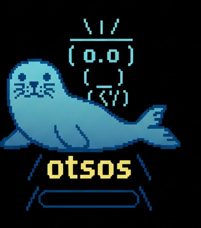

# OTSOS - Obviosly The Slowest Operating System

  

---

Simple [amd64](https://www.amd.com/content/dam/amd/en/documents/processor-tech-docs/programmer-references/24593.pdf) operating system writen in **C/GAS/Zig**

It have **own kernel** writen from scratch that seems like FreeBSD-like

it has its own DOD-ish syscall/API surface: `termWrite`, `termRead`,
`dataOpen`, `dataClose`, `procSpawn`, `procKill`, `drmCall`, and more.

terminal I/O goes through `term*` calls, not device nodes.

there are only 2 test lines: my pc (ASUS TUF Gaming FX706LI-H7010) and qemu.

---

### Disclaimer
> THis OS is **govno code** and licensed by [BSD 2 clause](https://opensource.org/license/bsd-2-clause)
